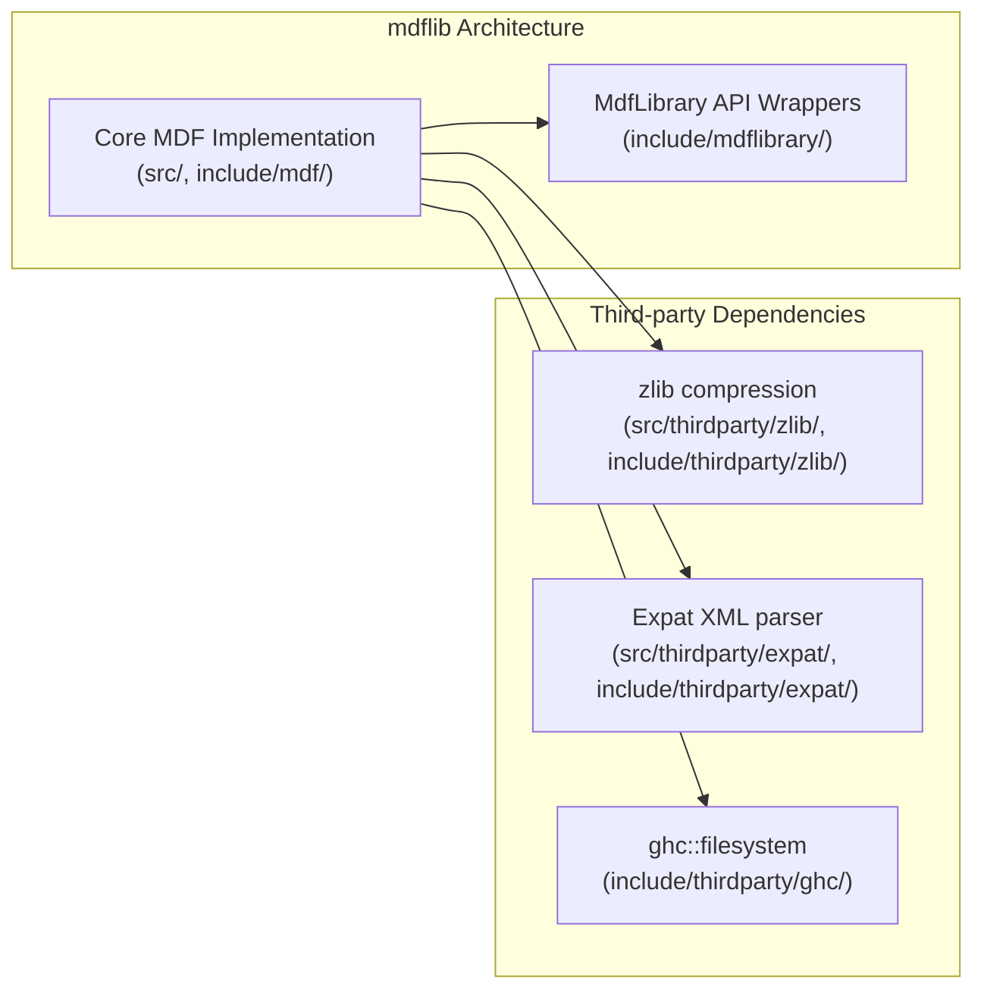
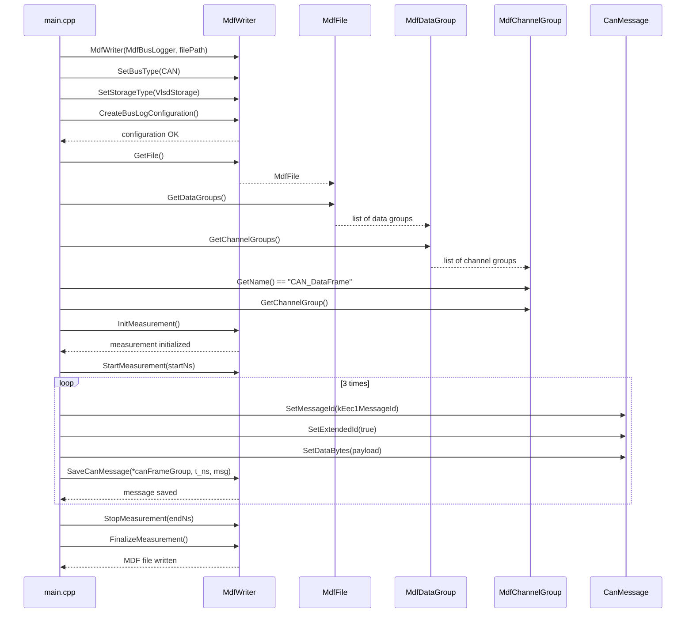
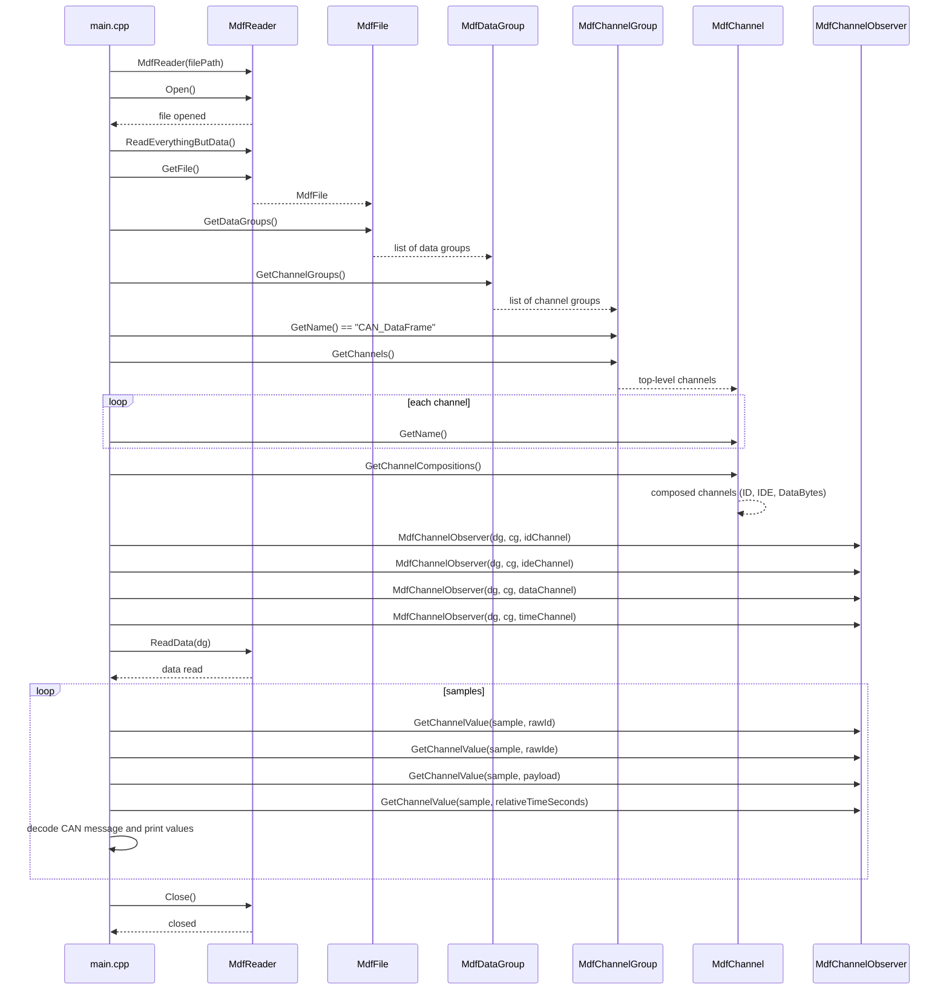

# MDFlib

`mdflib` is a library for reading and writing CAN frames in the ASAM MDF format, enabling structured, efficient bus data storage and analysis with engineering tool compatibility.

CAN frames are the raw messages exchanged on a Controller Area Network bus, carrying identifiers, flags, and payload bytes for vehicle and control system signals.

ASAM MDF is an ASAM standard for measurement data format that stores raw measurement records together with precise timestamps, channel metadata, and file-level descriptions. MDF files are designed for test and measurement applications, including automotive bus logging, where the same file can contain multiple data groups, channel groups, channel definitions, and attachments.

Typical MDF structure includes file header information, data group definitions, channel group definitions, channel descriptions, sample and measurement records, and optional attachments. In MDF, raw bus data is typically recorded as payload bytes in a binary data section, while separate metadata sections describe channels, data group structure, sample rates, and units.

This makes MDF a good fit for CAN logging because it preserves the original frame timing and allows later signal decoding.

Advantages of MDF4:

- native support for multi-channel and multi-group measurement data
- efficient binary storage with optional compression and indexing
- precise timestamping for frame-level synchronization
- built-in metadata support for channels, units, and file descriptions
- compatibility with ASAM toolchains and analysis workflows
- ability to store attachments and test context alongside raw data

Source: ASAM MDF standard / ASAM wiki: https://www.asam.net/standards/detail/mdf/wiki/

DBC files are CAN database files that describe how raw CAN message identifiers and payload bits map to named signals, units, scaling, and decoding rules. In automotive data workflows, a DBC is used together with MDF4 recordings to translate the binary payload bytes captured in a logged CAN frame into meaningful engineering values.

For MDF4 and CAN logging, the typical flow is:
- MDF4 records the raw CAN frames and timestamps in a measurement file.
- A separate DBC database defines the message format and signal semantics for those CAN frames.
- Post-processing tools read the MDF4 file and apply the DBC definitions to decode normalized signal values, units, and ranges.

Source: CAN DBC file database intro: https://www.csselectronics.com/pages/can-dbc-file-database-intro

The following snippet is a CAN signal preview example, demonstrating how a DBC message definition maps raw payload bits into named signals.

```text
BO_ 2297431040 EEC1: 8 Vector__XXX
 SG_ ECU_Engine_Torque : 16|8@1+ (1,-125) [-125|125] "%"  ECU
 SG_ ECU_Engine_Speed : 24|16@1+ (0.125,0) [0|3000] "rpm"  ECU
```

This DBC example shows a CAN message definition and two signal definitions.

- `BO_`: begins a message definition.
  - `2297431040`: CAN message ID.
  - `EEC1`: message name.
  - `8`: message payload length in bytes.
  - `Vector__XXX`: transmitting node or network name.

- `SG_`: begins a signal definition inside the message.
  - `ECU_Engine_Torque`: signal name.
  - `16|8`: starting bit position `16` and signal length `8` bits.
  - `@1+`: byte order and sign; `1` means Motorola (big-endian) and `+` means unsigned.
  - `(1,-125)`: scaling factor `1` and offset `-125`.
  - `[-125|125]`: physical value range from `-125` to `125`.
  - `%`: engineering unit.
  - `ECU`: receiver node for this signal.

- `SG_ ECU_Engine_Speed : 24|16@1+ (0.125,0) [0|3000] "rpm"  ECU`
  - `24|16`: starting bit position `24` and length `16` bits.
  - `@1+`: Motorola big-endian, unsigned value.
  - `(0.125,0)`: factor `0.125` and offset `0`.
  - `[0|3000]`: physical range from `0` to `3000`.
  - `"rpm"`: unit of measurement.
  - `ECU`: receiver node.

### CAN signal preview

```text
Byte | 7  6  5  4  3  2  1  0
 7   | 63 62 61 60 59 58 57 56
 6   | 55 54 53 52 51 50 49 48
 5   | 47 46 45 44 43 42 41 40
 4   | 39 38 37 36 35 34 33 32 (Engine speed pt 1/2)
 3   | 31 30 29 28 27 26 25 24 (Engine speed pt 2/2)
 2   | 23 22 21 20 19 18 17 16 (Engine Torque pt 1/1)
 1   | 15 14 13 12 11 10  9  8
 0   |  7  6  5  4  3  2  1  0
 ```

Speed value
 ```
 Data = 0b0010001000010011 = 0x2213 = 8723
 Physical value = 0.125 * 8723 + 0 = 1090.375 rpm
 ```

Torque value
 ```
Data = 0b11111111 = 0xFF = 255
Physical value = 1 * 255 + -125 = 130 %
 ```

This example illustrates how a DBC describes the raw CAN payload structure that can be mapped from MDF-recorded CAN frames into meaningful signal values.

This README documents the core architecture of `mdflib` and the `mdflibrary` wrapper API, as well as the write and read flows implemented in `main.cpp`.

## Architecture overview
`mdflib` provides the core MDF implementation and is wrapped by `mdflibrary` to expose a higher-level C++ API.

- `mdflib` core: MDF file structure, channel groups, data groups, and storage support.
- `mdflibrary` wrappers: simplified API classes such as `MdfWriter`, `MdfReader`, and `MdfChannelObserver`.
- Third-party support: zlib for compression, Expat for XML parsing, and ghc::filesystem for cross-platform file handling.



## What `mdflibrary` does

`mdflibrary` exposes a C++ wrapper over the low-level MDF implementation, providing a higher-level API for MDF file creation, inspection, and channel-based CAN data access.

Key capabilities:

- `MdfWriter`: configure and write MDF bus logging sessions, create data groups and channel groups, save CAN message samples, and finalize measurement files.
- `MdfReader`: open MDF files, load headers and metadata, enumerate available data groups and channel groups, and read raw measurement data for selected groups.
- `MdfFile`: represent a loaded MDF file handle, expose file name, version, attachments, and contained data groups.
- `MdfDataGroup`: represent a measurement group with channels, metadata, sample count, and record identifiers.
- `MdfChannelGroup`: represent a grouped set of channels, such as a CAN data frame group, and provide channel lookup and creation support.
- `MdfChannel`: represent a single channel definition, including name, unit, data type, display text, and value ranges.
- `MdfChannelObserver`: observe channel sample counts, units, metadata, and retrieve raw or engineering values at a specific sample index.
- `CanMessage`: wrap a CAN payload with ID, DLC, flags, and data bytes for writing into MDF.

This README is complemented by generated API documentation available in `doc/html/`, where the Doxygen class references for `MdfWriter`, `MdfReader`, `MdfFile`, `MdfDataGroup`, `MdfChannelGroup`, `MdfChannel`, `MdfChannelObserver`, and `CanMessage` describe the full wrapper API.

## Writing MDF from `main.cpp`
This section explains how `main.cpp` creates an MDF file by configuring CAN logging, selecting the `CAN_DataFrame` channel group, and saving CAN frames.

Key write steps:

1. Create `MdfWriter` with `MdfWriterType::MdfBusLogger`.
2. Set bus type to `CAN` and storage type to `VlsdStorage`.
3. Build the CAN bus log configuration.
4. Retrieve the current `MdfFile` and its `DataGroups`.
5. Find the `CAN_DataFrame` channel group.
6. Initialize measurement, start it, save messages, stop measurement, and finalize the file.

Example writer code:

```cpp
#include "mdflibrary/MdfWriter.h"
using namespace MdfLibrary;

void write(const std::string& filePath) {
    MdfWriter writer(MdfWriterType::MdfBusLogger, filePath.c_str());
    writer.SetBusType(MdfBusType::CAN);
    writer.SetStorageType(MdfStorageType::VlsdStorage);
    if (!writer.CreateBusLogConfiguration()) {
        std::cerr << "Failed to create CAN bus log configuration" << std::endl;
        return;
    }

    auto fileObj = writer.GetFile();
    auto dataGroups = fileObj.GetDataGroups();

    std::unique_ptr<MdfChannelGroup> canFrameGroup;
    for (auto& dg : dataGroups) {
        for (auto& cg : dg.GetChannelGroups()) {
            if (cg.GetName() == "CAN_DataFrame") {
                canFrameGroup = std::make_unique<MdfChannelGroup>(cg.GetChannelGroup());
                break;
            }
        }
        if (canFrameGroup != nullptr) break;
    }

    if (!writer.InitMeasurement()) {
        std::cerr << "Failed to initialize measurement" << std::endl;
        return;
    }

    writer.StartMeasurement(100000000ULL);
    // Write CAN frames using SaveCanMessage(...)
    writer.StopMeasurement(400000000ULL);
    writer.FinalizeMeasurement();
}
```



## Reading MDF from `main.cpp`
This section explains how `main.cpp` reads an MDF file, inspects the file structure, maps CAN channels, and extracts sample values with `MdfChannelObserver`.

Key read steps:

1. Create `MdfReader` and open the MDF file.
2. Call `ReadEverythingButData()` to load metadata.
3. Access the `MdfFile` and its `DataGroups`.
4. Find the `CAN_DataFrame` channel group.
5. Read the channel list and the composed CAN channels (`ID`, `IDE`, `DataBytes`).
6. Create observers for each target channel.
7. Call `ReadData()` for the selected `DataGroup`.
8. Iterate samples and decode raw CAN values.

Example reader code:

```cpp
#include "mdflibrary/MdfReader.h"
#include "mdflibrary/MdfChannelObserver.h"
using namespace MdfLibrary;

void read(const std::string& filePath) {
    MdfReader reader(filePath.c_str());
    if (!reader.Open()) {
        std::cerr << "Could not open MDF file" << std::endl;
        return;
    }

    reader.ReadEverythingButData();
    auto fileObj = reader.GetFile();
    auto dataGroups = fileObj.GetDataGroups();

    for (auto& dg : dataGroups) {
        for (auto& cg : dg.GetChannelGroups()) {
            if (cg.GetName() != "CAN_DataFrame") continue;
            auto topLevelChannels = cg.GetChannels();
            auto composedChannels = topLevelChannels.front().GetChannelCompositions();

            MdfChannelObserver idObserver(dg, cg, composedChannels[0]);
            MdfChannelObserver ideObserver(dg, cg, composedChannels[1]);
            MdfChannelObserver dataObserver(dg, cg, composedChannels[2]);
            MdfChannelObserver timeObserver(dg, cg, topLevelChannels.front());

            reader.ReadData(dg);
            for (int64_t sample = 0; sample < idObserver.GetNofSamples(); ++sample) {
                uint64_t rawId = 0;
                std::vector<uint8_t> payload;
                double relativeTimeSeconds = 0.0;
                idObserver.GetChannelValue(sample, rawId);
                dataObserver.GetChannelValue(sample, payload);
                timeObserver.GetChannelValue(sample, relativeTimeSeconds);
                // decode CAN payload and print values
            }
        }
    }

    reader.Close();
}
```



## Use cases for `mdflibrary`

`mdflibrary` is designed for projects that need to work with MDF files and CAN data in C++ applications. Common use cases include:

- Automotive data logging: capture CAN bus frames with precise time stamps and save them as ASAM MDF files.
- Post-processing and analysis: read MDF recordings, inspect channel groups, and extract raw CAN samples for signal decoding.
- Tool integration: bridge MDF data with DBC-based decoding workflows to convert raw CAN payloads into engineering values.
- Test and measurement automation: create, configure, and finalize MDF files from automated test rigs or data acquisition systems.
- Metadata inspection: query MDF file headers, channel definitions, group structure, and file attachments.
- Diagnostic archiving: preserve raw CAN frames and measurement context for troubleshooting, replay, and compliance reporting.

These use cases make `mdflibrary` suitable for engineers building CAN/MDF tooling, data converters, and recording or replay systems that must preserve the original measurement semantics.

